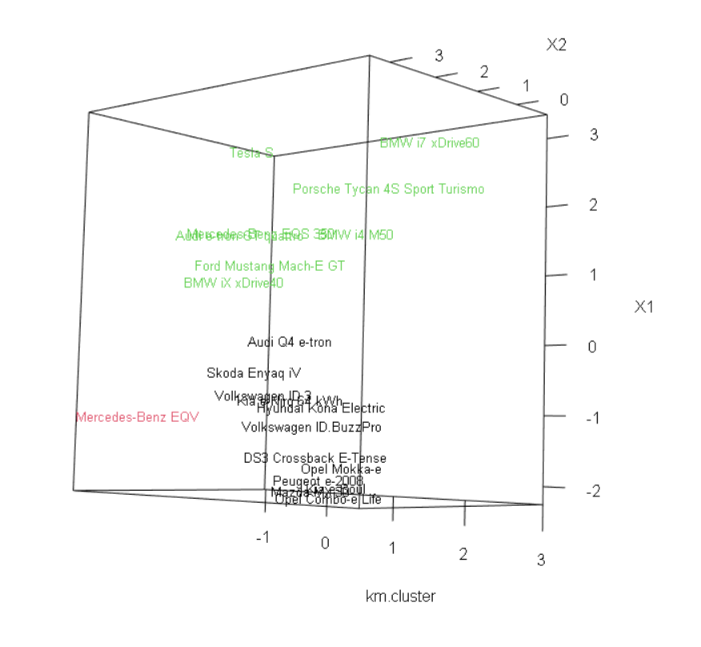

# Projekt {.tabset}

```{r message=FALSE, warning=FALSE,echo=FALSE}
options(width = 100)
library(readxl)
library(corrplot)
library(writexl)
library(stats)
library(factoextra)
library(psych)
library(cluster)
library(rgl)
```

## Opis i wstępna analiza wykorzystywanych danych {.active}

Celem projektu jest przedstwaienie rankingu aut elektrycznych wykorzystując metody porządkowania liniowego oraz przeprowadzenie analizy skupień.

 - Cena - [zł] cena podstawowego pakietu na dzień 05.10.2022r (dane zaczerpnięte z oficjalnych stron producentów) - destymulanta
 
 - Km - konie mechaniczne - stymulanta
 
 - Rozstaw_osi - [cm] - większy rozstaw osi wpływa na wyższy poziom bezpieczeństwa, jednak krótszy rozstaw poprawia zwrotność, dlatego zmienna ta jest nominantą na poziomie 250
 
 - Pojemnosc_bagaznika - [l] maksymalna pojemność bagażnika (przy złożonych tylnich siedzeniach) - najbardziej optymalną wielkością bagażnika jest 1183l 
 
 - Predkosc_maksymalna - [km/h] - stymulanta
 
 - Przyspieszenie - [s] od 0km/h do 100km/h - destymulanta
 
 - Zasieg - [km] odległość jakią auto przejedzie na jednym ładowaniu - stymulanta
 
 - Dostepnosc - liczba ogłoszeń na platformie OtoMoto na dzień 05.10.2022 - stymulanta
 
Wczytujemy dane:

```{r}
Auta <- read_excel("Auta.xlsx")
knitr::kable((Auta), "markdown")

```

### Podstawowe statystyki:

```{r}
knitr::kable(summary(Auta[,c(-1,-2)]), "markdown")
```
Wizualizacja:

```{r}
par(mfcol = c(2,4))
boxplot(Auta[,3]/1000,xlab="cena [tys.]",col="#FFE4E1",border = "#00084F", cex.lab=1.2)
boxplot(Auta[,4],xlab="Konie mechaniczne",col="#FFE4E1",border = "#00084F", cex.lab=1.2)
boxplot(Auta[,5],xlab="Rozstaw osi",col="#FFE4E1",border = "#00084F", cex.lab=1.2)
boxplot(Auta[,6],xlab="Pojemnosc bagaznika",col="#FFE4E1",border = "#00084F", cex.lab=1.2)
boxplot(Auta[,7],xlab="Predkosc maksymalna",col="#FFE4E1",border = "#00084F", cex.lab=1.2)
boxplot(Auta[,8],xlab="Przyspieszenie",col="#FFE4E1",border = "#00084F", cex.lab=1.2)
boxplot(Auta[,9],xlab="Zasieg",col="#FFE4E1",border = "#00084F", cex.lab=1.2)
boxplot(Auta[,10],xlab="Dostepnosc",col="#FFE4E1",border = "#00084F", cex.lab=1.2)
par(mfcol = c(1,1))
```

Wybrane auta to zarówno sportowe, miejskie jak i dostawcze, więc można zauważyć znaczne różnice w ilości *koni mechanicznych*. Wartość ta wacha się od 82 do nawet 670. Podobną rozbieżność auta wykazują w deklarowanym *maksymalnym zasięgu*. 

Rozbieżność *cenowa* nie zaskakuje, ponieważ zebrałyśmy auta z różnych marek, a jak wiadomo BMW czy Mercedes zawsze będzie droższy niż np. Kia. Biorąc pod uwagę *pojemność bagażnika*, auta dostawcze są obiektami mocno odstającymi. Analizując *rozstaw osi* najbardziej odstającym obiektem jest Smart ze względu na to, że jest dwuosobowy i bardzo malutki.


### Korelacja oraz współczynnik zmienności

```{r}
corrplot(cor(Auta[,c(-1,-2)]), method="circle", addCoef.col = "black")
```

Jak można zauważyć zmienna *Prędkość maksymalna* jest wysoko skorelowana zarówno z *Ceną* jak i *Km*, więc usuwamy ją z naszego zbioru zmiennych.

```{r}
corrplot(cor(Auta[,c(-1,-2,-7)]), method="circle", addCoef.col = "black")
Auta <- Auta[,-7]
```

W kolejnym kroku wyznaczamy współczynnik zmienności, który powninien wynosić więcej niż 10%. W przeciwnym wypadku zmienna nie różnicuje znacznie obiektów.

```{r}
cv <- c()
auta <- as.data.frame(Auta)
for (i in 3:ncol(auta)) {
  cv[i-2] <- (sd(auta[,i])/mean(auta[,i]))*100
}

zmienna <- c("Cena","Km","Rozstaw_osi","Pojemnosc_bagaznika","Przyspieszenie","Zasieg","Dostepnosc")
wspolczynnik_zmiennosci <- data.frame(zmienna = zmienna, wspolczynnik_zmiennosci = cv)
```
```{r}
knitr::kable((wspolczynnik_zmiennosci), "markdown", align = "rl")
```

Wszystkie zmienne spełniają założenie.

## Porządkowanie liniowe

Pierwszym krokiem w porządkowaniu liniowym jest zamiana wszystkich zmiennych na stymulany.
Zamieniając destymulanty na stymulanty mnożymy dane przez -1 (w naszym przypadku mamy dwie takie zmienne *Cena* i *Przyspieszenie*)

Zamieniając nominanty (to jest *Rozstaw_osi* i *pojemnosc_bagaznika*) na stymulanty korzystamy ze wzoru:

dla $x_{ij}=N_j$ $z_{ij}=1$

dla $x_{ij}>N_j$ $z_{ij}=\frac{1}{x_{ij}-N_j+1}$

dla $x_{ij}<N_j$ $z_{ij}=\frac{1}{x_{ij}-N_j-1}$

```{r}
auta_stymulanty_cena <- c()
for(i in 1:nrow(auta)){
  auta_stymulanty_cena[i] = auta[i,3]*-1
}

auta_stymulanty_rozstaw_osi <- c()
for (i in 1:nrow(auta)) {
  if(auta[i,4] > 250){
    auta_stymulanty_rozstaw_osi[i] = 1/(auta[i,5]-250+1)
  } 
  else if(auta[i,4] < 250){
    auta_stymulanty_rozstaw_osi[i] = -1/(auta[i,5]-250-1)
  } 
  else if(auta[i,4] == 250){
    auta_stymulanty_rozstaw_osi[i] = 1
  }
}

auta_stymulanty_pojemnsc_bagaznika <- c()
for (i in 1:nrow(auta)) {
  if(auta[i,5] > 1183){
    auta_stymulanty_pojemnsc_bagaznika[i] = 1/(auta[i,6]-1183+1)
  } 
  else if(auta[i,5] < 1183){
    auta_stymulanty_pojemnsc_bagaznika[i] = -1/(auta[i,6]-1183-1)
  } 
  else if(auta[i,5] == 1183){
    auta_stymulanty_pojemnsc_bagaznika[i] = 1
  }
}

auta_stymulanty_przyspieszenie <- c()
for(i in 1:nrow(auta)){
  auta_stymulanty_przyspieszenie[i] = auta[i,7]*-1
}

auta_stymulanty <- data.frame(Marka = auta$Marka, Model = auta$Model, Cena = auta_stymulanty_cena, Km = auta$Km, Rozstaw_osi = auta_stymulanty_rozstaw_osi, Pojemnosc_bagaznika = auta_stymulanty_pojemnsc_bagaznika, Przyspieszenie = auta_stymulanty_przyspieszenie, Zasieg = auta$Zasieg,Dostepnosc = auta$Dostepnosc)
```

```{r}
knitr::kable((head(auta_stymulanty,4)), "markdown")
```

Następnie przeprowadzamy standaryzację danych za pomocą funkcji scale.
```{r echo=FALSE}
auta_stand_cena <- c()
auta_stand_cena <- scale(auta_stymulanty$Cena)

auta_stand_km <- c()
auta_stand_km <- scale(auta_stymulanty$Km)

auta_stand_rozstaw_osi <- c()
auta_stand_rozstaw_osi <- scale(auta_stymulanty$Rozstaw_osi)

auta_stand_pojemnosc_bagaznika <- c()
auta_stand_pojemnosc_bagaznika <- scale(auta_stymulanty$Pojemnosc_bagaznika)

auta_stand_przyspieszenie <- c()
auta_stand_przyspieszenie <- scale(auta_stymulanty$Przyspieszenie)

auta_stand_zasieg <- c()
auta_stand_zasieg <- scale(auta_stymulanty$Zasieg)

auta_stand_dostepnosc <- c()
auta_stand_dostepnosc <- scale(auta_stymulanty$Dostepnosc)

auta_stand <- data.frame(Marka = auta_stymulanty$Marka, Model = auta_stymulanty$Model, Cena = auta_stand_cena, Km = auta_stand_km, Rozstaw_osi = auta_stand_rozstaw_osi, Pojemnosc_bagaznika = auta_stand_pojemnosc_bagaznika, Przyspieszenie = auta_stand_przyspieszenie, Zasieg = auta_stand_zasieg, Dostepnosc = auta_stand_dostepnosc)

```

```{r}
knitr::kable((head(auta_stand,4)), "markdown")
```

Po przeprowadzeniu zamiany danych na stymulanty oraz ich standaryzacji możemy przystąpić do tworzenia rangingów za pomocą poszczególnych metod.

### Metoda Hellwiga

Pierwszy ranking budujemy wykorzystując metodę Hellwiga.

Wyznaczamy wzorzec - parametry idealnego obiektu

```{r echo=FALSE}
wzorzec_cena <- max(auta_stand_cena)
wzorzec_km <- max(auta_stand_km)
wzorzec_rozstaw_osi <- max(auta_stand_rozstaw_osi)
wzorzec_pojemnosc_bagaznika <- max(auta_stand_pojemnosc_bagaznika)
wzorzec_przyspieszenie <- max(auta_stand_przyspieszenie)
wzorzec_zasieg <- max(auta_stand_zasieg)
wzorzec_dostepnosc <- max(auta_stand_dostepnosc)
wzorzec <- c(wzorzec_cena,wzorzec_km,wzorzec_rozstaw_osi,wzorzec_pojemnosc_bagaznika,wzorzec_przyspieszenie,wzorzec_zasieg,wzorzec_dostepnosc)
```
```{r}
wzorzec
```

Kolejnym etapem jest wyznaczenie odleglosci poszczególnych obiektow od wzorca.

```{r echo=FALSE}
odleglosc <- c()
a <- 1
for (j in 1:nrow(auta_stand)) {
  for (i in 3:ncol(auta_stand)) {
    odleglosc[a] <- (auta_stand[j,i]-wzorzec[i-2])^2
    a <- a + 1
  }
}

odleglosc_obiektu <- c()
a <- 1 
i <- 1
while (i <= 168){
  odleglosc_obiektu[a] <- sqrt(odleglosc[i]+odleglosc[i+1]+
                                 odleglosc[i+2]+odleglosc[i+3]+
                                 odleglosc[i+4]+odleglosc[i+5]+odleglosc[i+6])
  i <- i + 7 
  a <- a + 1
}
```

```{r}
odleglosc_obiektu
```

Tworzymy odleglość "możliwie daleką"

```{r}
mean <- mean(odleglosc_obiektu)
sd <- sd(odleglosc_obiektu)
(d0 <- mean + 2*sd)
```

Wyznaczamy wartości miary dla każdego obiektu.

```{r echo=FALSE}
wartosc <- c()
for(i in 1:24){
  wartosc[i] <- 1-odleglosc_obiektu[i]/d0
}

wartosc_miary <- data.frame(Marka = auta_stand$Marka, 
                               Model = auta_stand$Model,
                               Wartosc = wartosc)
```
```{r}
knitr::kable(head((wartosc_miary),5), "markdown", align = "lll")
```

Ostatnim etapem jest utworzenie rangingu aut elektrycznych.

```{r}
ranking_hellwig <- wartosc_miary[order(-wartosc_miary$Wartosc),]
knitr::kable((ranking_hellwig), "markdown", align = "lll")
```

### Metoda sumy rang

W celu nadania rang poszczególnym cechom wczytujemy zestandaryzowane dane do excela

```{r}
# write_xlsx(auta_stand,"Auta_rangi.xlsx")

Auta_rangi <- read_excel("Auta_rangi.xlsx")
knitr::kable((head(Auta_rangi,5)), "markdown")
```

Następnie dla każdego obiektu obliczamy sumy z uzyskanych rang.

```{r}
suma_rangi <- c()
for (i in 1:nrow(Auta_rangi)) {
  suma <- 0
  for (j in 4:ncol(Auta_rangi)){
    if (j%%2==0){
      suma <- suma + Auta_rangi[i,j]
    }
    suma_rangi[i] <- suma
  }
}
wartosc_miary <- data.frame(Marka = Auta_rangi$Marka, Model = Auta_rangi$Model)
for (i in 1:nrow(Auta_rangi)) {
  wartosc_miary[i,3] <- suma_rangi[i]
}
```

Posortowanie obiektów względem wartości uzyskanych w poprzednim kroku tworzy finalny ranking.

```{r}
ranking_sumy_rang <- wartosc_miary[order(-wartosc_miary$V3),]
knitr::kable((ranking_sumy_rang), "markdown", align = "lll")
```


### Metoda Standaryzowanych Sum

Ostatnią wykorzystywaną przez nas metodą jest metoda standaryzowanych sum.

Rozpoczynamy od budowania syntetycznej miary, czyli zsumowania oszacowań uzyskanych w ramach obiektów.

```{r}
suma_oszacowan <- c()
for (i in 1:nrow(auta_stand)) {
  suma <- 0
  for (j in 3:ncol(auta_stand)){
    suma <- suma + auta_stand[i,j]
  }
  suma_oszacowan[i] <- suma/7
}
```

Następnie standaryzujemy oraz sortujemy uzyskane wartości, tworząc w ten sposób ranking.

```{r}
min <- min(suma_oszacowan)
max <- max(suma_oszacowan-min)
suma_oszacowan_standaryzacja <- c()

for (i in 1:length(suma_oszacowan)) {
  suma_oszacowan_standaryzacja[i] <- (suma_oszacowan[i]-min)/max
}

wartosc_miary <- data.frame(Marka = Auta$Marka, Model = Auta$Model, Oszacowanie = suma_oszacowan_standaryzacja)
ranking_sum <- wartosc_miary[order(-wartosc_miary$Oszacowanie),]
knitr::kable((ranking_sum), "markdown", align = "lll")
```

Zestawiamy wszystkie obliczone powyżej rankingi.

```{r}
knitr::kable(data.frame(Hellwig = paste(ranking_hellwig$Marka,ranking_hellwig$Model), Sumy_rang = paste(ranking_sumy_rang$Marka,ranking_sumy_rang$Model),Standaryzowanych_sum = paste(ranking_sum$Marka,ranking_sum$Model)), format="markdown",align = "lll")
```
Rankingi różnią się między sobą jednak, za każdym razem w najlepszej grupie znajdują się: Tesla S, Audi e-tron, Nissan Leaf oraz Ford Mustang Mach-E. Nikt nie powinien być zaskoczony wysoką pozycją Tesli, ponieważ jest ona pionierem wśród aut elektrycznych. Nissan znalazł się w tej grupie, dzięki dostępności, która jest największa wśród rozpatrywanych aut, ma on też stosunkowo niską cenę jak na auto z takimi parametrami.

Najgorszymi autami ze danego zbioru okazały się: Opel Combo-e, Kia e-Soul oraz Smart EQ. Jednym z powodów jest mała ilość koni mechanicznych, co przekłada się na długi czas w jakim auta osiągają 100km/h. Dodatkowo Smart w dniu zbierania danych nie był dostępny w sprzedaży na serwisie OtoMoto, co mocno działa na jego niekorzyść.

Największym zaskoczeniem dla nas był dość niskie miejsce w rankingu marki BMW, ponieważ cechuje je dobre przyśpieszenie i daleki zasięg. Jest to jednak jedna z najdroższych marek na Polskim rynku.


## Analiza skupień

Kolejną częścią projektu jest przeprowadzenie analizy skupień.

Wykorzystujemy do tego zestandaryzowane dane.

```{r}
auta_standaryzacja_cena <- c()
auta_standaryzacja_cena <- scale(Auta$Cena)

auta_standaryzacja_km <- c()
auta_standaryzacja_km <- scale(Auta$Km)

auta_standaryzacja_rozstaw_osi <- c()
auta_standaryzacja_rozstaw_osi <- scale(Auta$Rozstaw_osi)

auta_standaryzacja_pojemnosc_bagaznika <- c()
auta_standaryzacja_pojemnosc_bagaznika <- scale(Auta$Pojemnosc_bagaznika)

auta_standaryzacja_przyspieszenie <- c()
auta_standaryzacja_przyspieszenie <- scale(Auta$Przyspieszenie)

auta_standaryzacja_zasieg <- c()
auta_standaryzacja_zasieg <- scale(Auta$Zasieg)

auta_standaryzacja_dostepnosc <- c()
auta_standaryzacja_dostepnosc <- scale(Auta$Dostepnosc)

auta_standaryzacja <- data.frame(Marka = Auta$Marka, Model = Auta$Model, Cena = auta_standaryzacja_cena, Km = auta_standaryzacja_km, Rozstaw_osi = auta_standaryzacja_rozstaw_osi, Pojemnosc_bagaznika = auta_standaryzacja_pojemnosc_bagaznika, Przyspieszenie = auta_standaryzacja_przyspieszenie, Zasieg = auta_standaryzacja_zasieg, Dostepnosc = auta_standaryzacja_dostepnosc)
```


### Grupowanie hierarchiczne

We wstępnej analizie danych na wykresach pudełkowych z wąsem, można zauważyć, że mamy wartości odstające. Dlatego przed przystąpieniem do analizy skupień usuwamy je, wykorzystując regułę trzech sigm.

```{r}
numer_wiersza <- c()
for (i in 1:nrow(auta_standaryzacja)){
  for (j in 3:ncol(auta_standaryzacja)) {
    if (abs(auta_standaryzacja[i,j])>3){
      numer_wiersza[i] <- i
    }
  }
}
numer_wiersza <- numer_wiersza[!is.na(numer_wiersza)]
auta <- auta_standaryzacja[-numer_wiersza,]
```

Wyznaczamy macierz odległości pomiędzy obiektami, wykorzystując odległość euklidesową.

```{r warning=FALSE}
d <- dist(x = auta, method = "euclidean")
```

Wykonujemy grupowanie hierarchiczne za pomocą wybranych metod.

#### Metoda najbliższego sąsiąda

```{r out.width="150%"}
single <- hclust(d, method = "single")
{plot(single, hang = -1, cex = 0.5, labels = paste(auta[,1],auta[,2]))
abline(h=1.8,lty=2,col="red")}
```

#### Metoda najdalszego sąsiada

```{r out.width="150%"}
complete <- hclust(d, method = "complete")
{plot(complete, hang = -1, cex = 0.5, labels = paste(auta[,1],auta[,2]))
abline(h=4.4,lty=2,col="red")}
```

#### Metoda Warda
 
```{r out.width="150%"}
ward.D2 <- hclust(d, method = "ward.D2")
{plot(ward.D2, hang = -1, cex = 0.5, labels = paste(auta[,1],auta[,2]))
abline(h=5.2,lty=2,col="red")}
```

Analizując powyższe dendogramy, wydaje się, że optymalnym podziałem jest podział na trzy grupy.

### Grupowanie podziałowe

#### Metoda k-srednich

Metoda profilu

```{r}
fviz_nbclust(auta[,-c(1,2)],kmeans, method = "silhouette")
```

Metoda łokcia

```{r}
fviz_nbclust(auta[,-c(1,2)],kmeans, method = "wss")
```

Kierując się metodą łokcia oraz profilu powinnyśmy podzielić dane na dwie grupy.

```{r}
km <- kmeans(x = auta[,-c(1,2)], centers = 2, nstart = 20)
fviz_cluster(km,auta[,-c(1,2)])
```

Na wykresie można jednak zauważyć, że obserwacja 11 znacząco odstaje od pozostałych obiektów w grupie, dlatego podział na 3 grupy wydaje się być bardziej uzasadniony.

```{r}
km <- kmeans(x = auta[,-c(1,2)], centers = 3, nstart = 20)
fviz_cluster(km,auta[,-c(1,2)])
```


#### Metoda k-medoid

Metoda profilu

```{r}
fviz_nbclust(auta[,-c(1,2)],pam, method = "silhouette")
```

Metoda łokcia

```{r}
fviz_nbclust(auta[,-c(1,2)],pam, method = "wss")
```

Zgodnie z metodą profilu optymalny jest podział na 2 grupy, natomiast metoda łokcia wskazuje na 2 lub 5 grup. Zwizualizujmy zatem podział na 5 grup.

```{r}
p <- pam(x = auta[,-c(1,2)], k = 5, metric = "euclidean")
fviz_cluster(p,auta[,-c(1,2)])
```

Uwzględniając metody z grupowania hierarchicznego i podziałowego postanowiłyśmy podzielić dane na 3 grupy.

## Skalowanie wielowymiarowe

Zajmiemy się teraz wizualizacją podziału danych na grupy.

### Klasyczne skalowanie wielowymiarowe

Skalujemy do dwóch wymiarów

```{r}
odl <- dist(auta[,-c(1,2)])
skalowanie <- cmdscale(odl,k=2)
```

Wizualizujemy grupy uzyskane metodą k-średnich.
```{r out.width="150%"}
grupa_srednich <- data.frame(skalowanie, km$cluster)
{plot(grupa_srednich[,-3], type="n")
text(grupa_srednich,labels = paste(auta[,1],auta[,2]), cex = 0.6, col = grupa_srednich$km.cluster)}
```

Wizualizujemy w trzech wymiarach
```{r}
skalowanie2 <- cmdscale(odl,k=3)
grupa_medoid2 <- data.frame(skalowanie2, km$cluster)
{plot3d(grupa_medoid2[,-3], type="n",xlim = 2,ylim=2,zlim=2)
text3d(grupa_medoid2,texts = paste(auta[,1],auta[,2]), cex = 0.8, col = grupa_medoid2$km.cluster)}


```

Przedstawiając dane w przestrzeni trzy-wymiarowej nie zauważamy znacznych różnic w stosunku do przestrzeni dwu-wymiarowej oraz widzimy, że dane w poszczególnych grupach są blisko siebie.

Podstawowe statystyki w grupach

```{r}
y <- describeBy(auta[,-c(1,2)], km$cluster)
knitr::kable(y[1], "markdown", align = "lll", caption = "Grupa Zielona")
knitr::kable(y[3], "markdown", align = "lll", caption = "Grupa czarna")
knitr::kable(y[2], "markdown", align = "lll", caption = "Grupa czerwona")
```

W efekcie końcowym ostrzymałyśmy trzy wyraźnie różniące się grupy.

Grupa zielona to auta sportowe które charakteryzuje duża moc oraz szybkie przyspieszenie. Są one również z wysokiej półki cenowej.

Do grupy czarnej trafiły auta ze średniej półki, które nie wyróżniają się żadnymi parametrami.

Ostatnią grupą (czwerwoną) jest auto dostawcze, które znacznie różni się pojemnością bagażnika. Dlatego też nie jest możliwe policzenie niektórych statystyk.